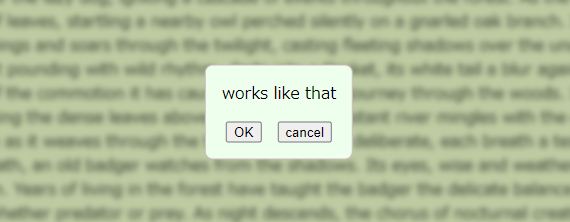

# about
simple js module to show a frontmost confirm element with a blur effect



# usage
## import
```
import showConfirm from './showConfirm.js/showConfirm.js';
```

## simplest usage
Comes in default with a single "OK" button that simply closes the element.
```
showConfirm('your message here');
```

## custom function
To specify the button function.
The element closes after the button is clicked.
```
const callbacks = [
  {
    name: "ok",
    function: () => {console.log("hello")}
  }
];
showConfirm('your message here', callbacks);
```

## custom function buttons
Create multiple buttons.
The element closes after a button is clicked.
```
const callbacks = [
  {
    name: "hello",
    function: () => {console.log("hello")}
  },
    {
    name: "bye",
    function: () => {console.log("bye")}
  }
];
showConfirm('your message here', callbacks);
```

## custom labels
Optional, specifies the label of the button.
```
const callbacks = [
  {
    name: "hello",
    function: () => {console.log("hello")},
    label: "say hello"
  }
];
```

## hide the default ok button
Specify the ok function to null to hide the default "OK" button.
If no button is created, any click on the element will close it.
```
const callbacks = [
  {
    name: "ok",
    function: null
  }
];
```